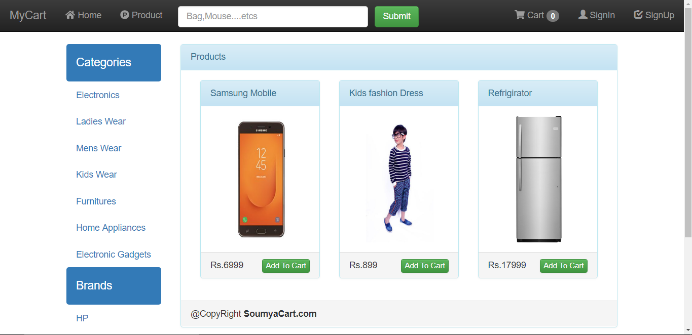
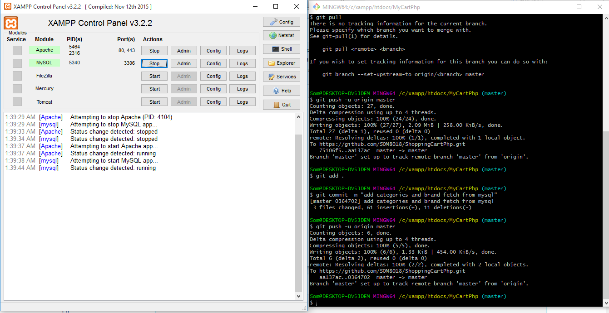

# ShoppingCartPhp
This Web Application developed using php,ajax,jquery.Custom Lay Architecture
# How to start project
start apache and mysql on xampp server check mysql database name and style="color:orange;">username</span>  and password
here in "db.php"
```json
$servername="localhost";
$username="root";
$password="";
$db="mycart";
$con = mysqli_connect($servername,$username,$password,$db);
```
# Screenshot of the Web Interface

# Screenshot of the Terminal

